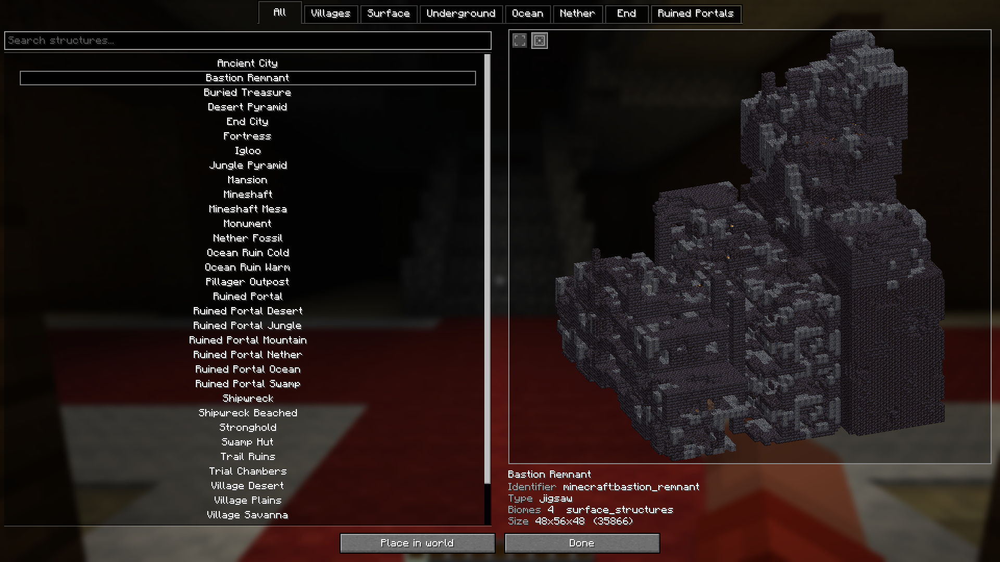
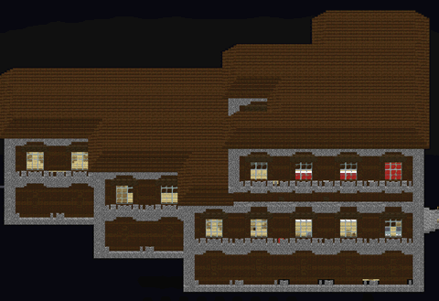
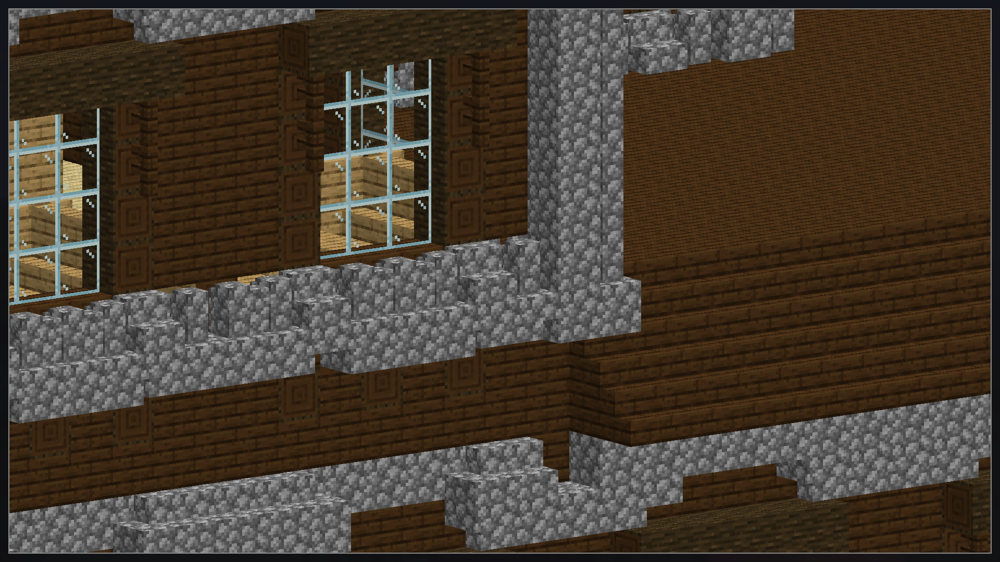
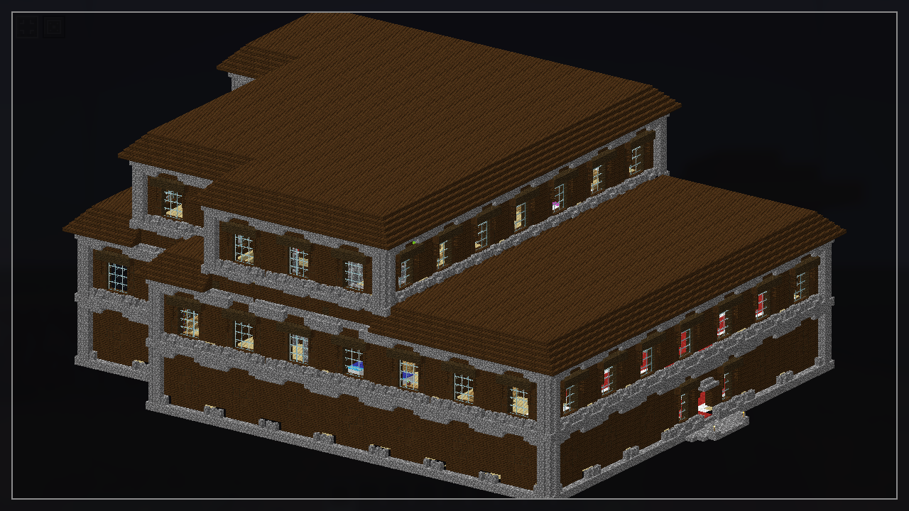
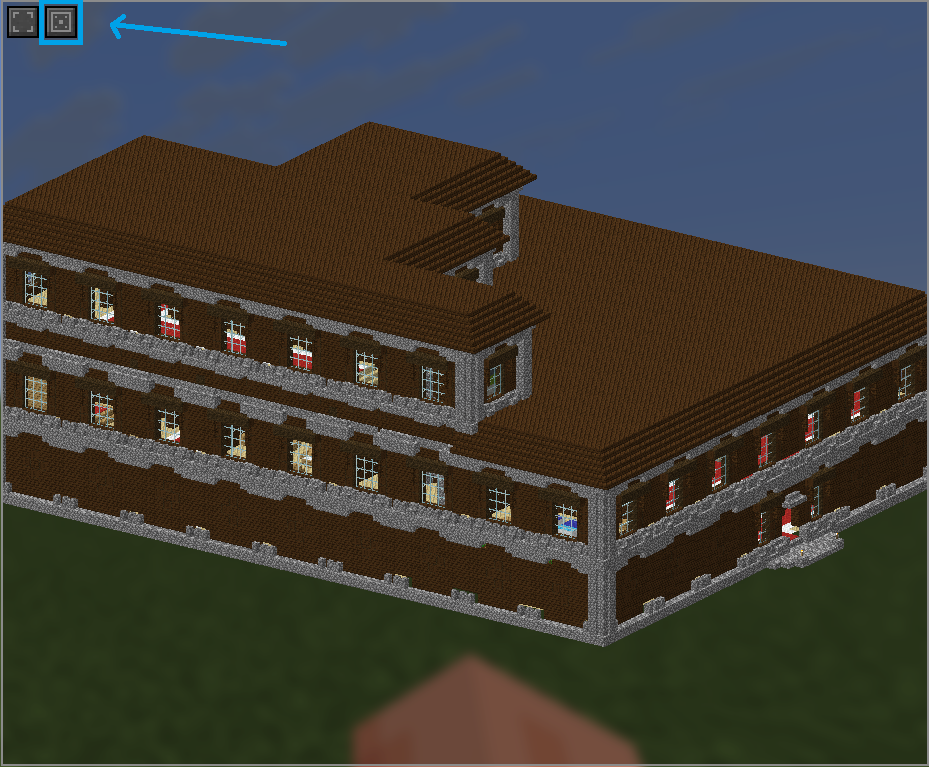
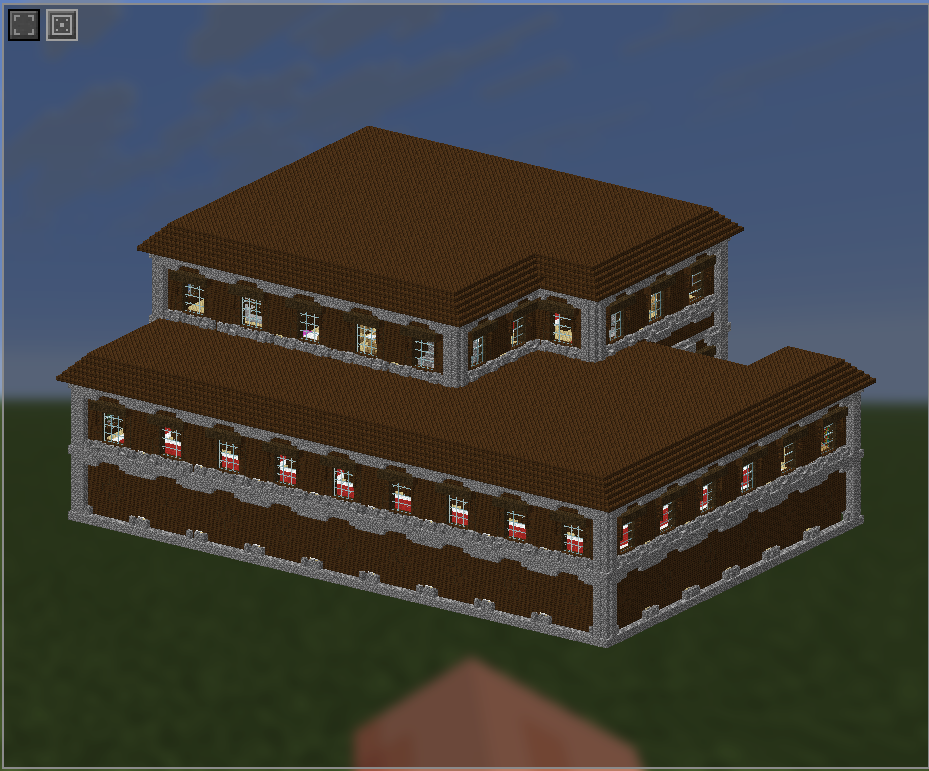
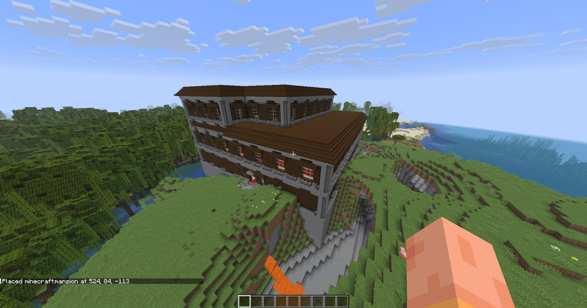
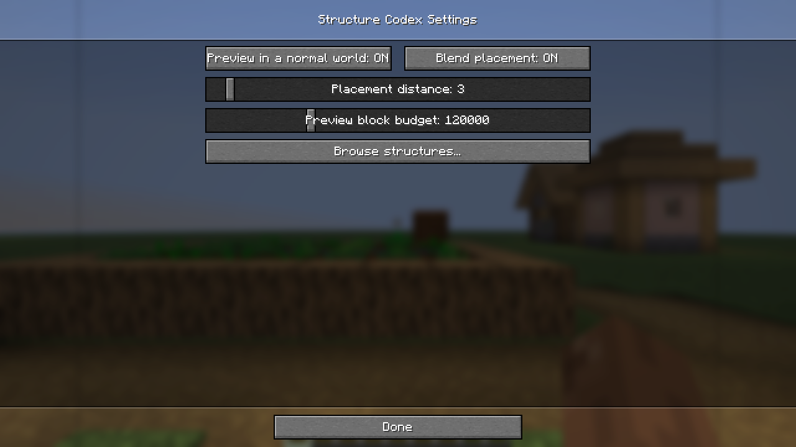

# Structure Codex

Fabric mod that adds an in-game catalog of every structure your world can generate. Press K to open it.

## Mod features

### Every structure in one place

The list comes straight from the game's registry, so vanilla structures, modded ones and anything a datapack adds all show up on their own. Tabs by category, plus a search box.

### Real 3D previews

Each structure is drawn with Minecraft's own terrain renderer. Drag to turn it, scroll to zoom.

### Zoom in as far as you like

### Fullscreen

For structures that don't fit in the side panel.

### Reroll the layout

Villages, outposts and other jigsaw structures come out differently every time they generate. The dice button rolls another one.

### Place it in your world

Drops the structure at your feet, built through normal world generation so it settles into the terrain instead of hanging in the air. Only the structure's own blocks are written and its rooms are hollowed out, so no cube of empty space gets punched into the landscape.

### Settings

## Note

Browsing and previewing work anywhere - singleplayer, LAN, and any server, including vanilla and plugin ones that have never heard of this mod. When a server doesn't hand over its structure data, the mod loads its own from your game files and generates the previews locally.

The catch on someone else's server is that it can only show what you have: a structure that exists solely in a server-side datapack won't be listed, and if the server overrides a vanilla structure, you'll see your version rather than theirs. On a modpack, where the datapacks come inside the mods everyone runs, this doesn't come up.

Placing needs Structure Codex on the server as well, plus creative mode or operator permission.
